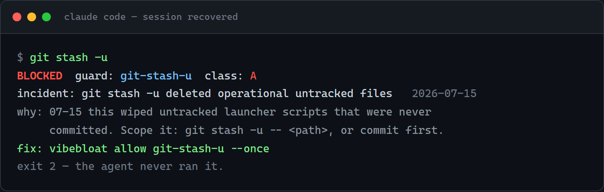
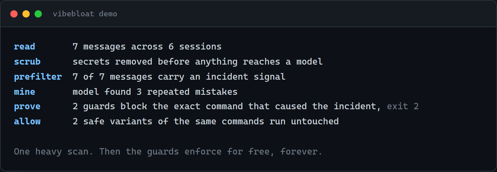
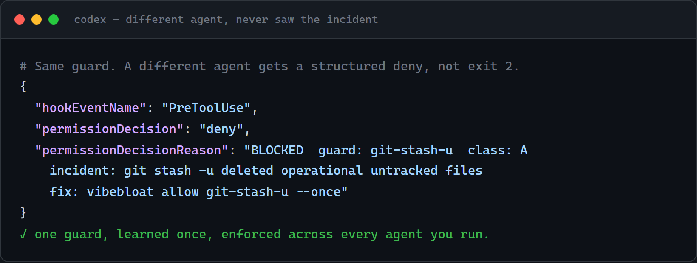

# VibeBloat

**Your coding environment learns from your agent mistakes and gets harder to break over time.**

VibeBloat is not a static command blocklist. It privately onboards to your agent
setup and history, uses semantic recall to recognize old failure patterns even
when they are reworded, and turns the lessons you approve into deterministic
guards shared across your tools. Incremental scans keep proposing new and
stronger protections as you work; a human still approves every hard block.

## OpenAI Build Week judges: start here

The fast demo shows the enforcement end of VibeBloat's larger learning loop:

1. **Personal onboarding:** detect your agents and history sources, then let you
   choose privacy, recall, review, and enforcement preferences.
2. **Semantic memory:** retrieve relevant past incidents by meaning, not only by
   exact command tokens.
3. **Learning over time:** incremental scans and daily strengthening propose new
   lessons as your history grows.
4. **Safe enforcement:** only human-approved guards become deterministic blocks.

This deterministic two-minute path uses invented sample history. It reads none
of your data, needs no API key, and makes no model call:

```sh
git clone https://github.com/veltri-23/vibebloat.git
cd vibebloat
bun install --frozen-lockfile --omit peer
bun src/cli.ts demo --no-model
```

Expected proof: three dangerous commands blocked with exit code `2`, two safe
variants allowed with exit code `0`, then the same guard returned as a structured
Codex denial.

**[Full judge guide](JUDGES.md)** · **[Green public CI](https://github.com/veltri-23/vibebloat/actions/runs/29882290235)** · **Codex session:** `019f7184-325b-7ec0-879a-856b59de5e17`

## Install and onboard (recommended)

The onboarding is the product setup, not an optional tutorial. It discovers your
agents and history sources, asks what VibeBloat may read, lets you choose lexical
or local semantic recall, reviews the lessons it finds, and installs only the
hooks and guards you approve.

```sh
git clone https://github.com/veltri-23/vibebloat.git
cd vibebloat
bun install --frozen-lockfile --omit peer
bun link
vibebloat init --pretty
```

Onboarding prints one consent gate at a time so every decision is explicit and
resumable. Answer with an option exactly as displayed, then rerun the pretty view
for the next gate. Repeat until the flow finishes:

```sh
vibebloat init --answer "Yes"
vibebloat init --pretty
```

Finish by verifying the approved integrations:

```sh
vibebloat doctor
```

See the [judge guide's personalized onboarding path](JUDGES.md#evaluate-personalized-onboarding)
for focused proof of onboarding, semantic recall, and learning over time.

Give an agent enough rope and it will eventually run `git stash -u` over untracked files, `docker compose down -v` on the dev database, or `git reset --hard` over an hour of uncommitted work. You fix it, you move on, and three days later a different agent does the same thing. The lesson lives in your head, not in the tools.

VibeBloat reads your agent history, finds the failures that actually burned you,
and compiles each approved lesson into a deterministic guard. The first scan
builds your personal baseline; bounded returning scans process new evidence and
propose updates. Between scans, guards enforce for free across agents: no tokens,
no prompt budget, and nothing a model can talk itself out of.

<p align="center">
  
</p>

## What the demo proves

`demo` needs no history of your own. It scrubs a sample agent history, prefilters for incident signal, mines the repeated mistakes, compiles guards, then shows those guards blocking the exact commands that caused the incidents and letting the safe variants through. With a model key set it mines the findings live. Without one it uses the sample's precomputed findings and says so plainly.

<p align="center">
  
</p>

On a machine with real agent sessions, `bun src/cli.ts init --pretty` (or `npx vibebloat init` once published) runs the same onboarding against your own history and installs only the guards you approve.

## Why this is different

There is a well-loved static blocker out there, `destructive_command_guard`, with 5,000 stars. It ships one universal blocklist of dangerous commands. Useful, but it does not know you, and it blocks the same things for everyone.

VibeBloat is the opposite bet. It does not guess what is dangerous. It watches what already went wrong *for you* and turns those specific incidents into guards. The block quotes the real event, with the date and the one-line reason, so when it fires you know exactly why. Three properties, and no other project we found has all three:

- **Learned, not hand-written.** Guards come from your own repeated incidents, mined by a model, not from a maintainer's opinion of what counts as risky.
- **Deterministic at enforcement time.** The model runs once, during the scan. The thing standing between your agent and a wiped volume is a plain data rule and an `exit 2`, not another LLM call that can be jailbroken or rate-limited.
- **Cross-agent.** One guard, learned in Claude Code, also stops Codex, a shell shim, or a git hook. The lesson follows you across every tool that can run a command.

## One lesson, every agent

The guard the scan produces is agent-agnostic. Claude Code gets an `exit 2` at its `PreToolUse` chokepoint. Codex gets a structured deny at the same point. A raw shell gets a shim, git gets a hook, the filesystem gets a quarantine. All of them share one `match(guard, event)` core, so you teach the mistake once.

<p align="center">
  
</p>

## What ships in the library

Every guard below was compiled from a real incident, most of them from building this project. `class` is the severity: `A` is destructive (block), `B` is a bad edit or config (block or warn), `C` is environmental (warn), `D` is a wrong result (warn).

| Guard | Class | What it stops |
|-------|-------|----------------|
| `git-stash-u` | A | `git stash -u` deleting untracked operational files |
| `git-reset-hard` | A | `git reset --hard` discarding committed work |
| `git-checkout-discard` | A | `git checkout -- <path>` clobbering tracked files |
| `git-clean-force` | A | `git clean -fd` silently removing untracked scripts |
| `git-checkout-parallel-revert` | A | parallel-agent worktrees overwriting each other |
| `mcp-config-wrong-file` | A | `.mcp.json` written to the wrong file path |
| `npx-mcp-hang` | B | `npx -y` re-resolving deps and hanging the agent |

These are the seed set. Your own guards compile from your history on first `init`, and you can add or retire any of them with `vibebloat allow <guard-id>`.

## How it works

1. **Discover** local agent histories without printing their paths.
2. **Consent.** Require explicit source confirmation and privacy opt-in before reading anything.
3. **Scrub** locally before anything reaches a model, fail closed. A source or npm install runs the built-in in-process scrubber — known key formats, credentials in URLs, and high-entropy strings — and halts the ingest if a known secret survives. A signed release can instead drive controlled external Presidio and Gitleaks commands. Either way, only the mined rule is ever shared, never raw history.
4. **Mine, review, compile, prove.** Turn repeated incidents into declarative guards and prove each one blocks the command that caused it.
5. **Install** only the guards a human approved, through native agent hooks with shell, git, and filesystem fallbacks.

Guards are data, never code. A guard names a condition and one of a fixed set of trusted actions (`block`, `warn`, `require-confirm`, `quarantine-file`, `run-check`). The runtime performs the effect. A contributed guard can describe a mistake, but it can never ship you an executable payload. Command matching runs on a real `tree-sitter-bash` parse, not a regex, so `git stash --include-untracked` and `git stash -u` resolve to the same thing. The matcher fails closed on a match and open on a parse error, so a guard it cannot understand never silently disarms.

### Recall: the guards learn to generalize

A blocklist only stops the exact string it was built from. VibeBloat can go one step further with semantic recall (`[semantic] recall = lexical | embed | local | off`). When an agent runs a command that *rhymes* with a past incident but is worded differently, recall surfaces the old lesson as a warning instead of missing it. `local` runs a real offline neural embedder (MiniLM, cached after first use, no network, no API key), so a reworded command lands near its incident by meaning, not by shared tokens. It is warn-tier and opt-in, and every promotion to a hard block still goes through a human.

## Built with Codex and GPT-5.6

The core of VibeBloat was designed and built with Codex on GPT-5.6 during OpenAI Build Week. Codex did the heavy structural work: the agent-agnostic `match(guard, event)` engine, the scrub-before-model pipeline, the tree-sitter command parser, and the native-plus-fallback chokepoint system that lets one guard cover Claude Code, Codex, shell, and git.

Where it earned its keep was the boring, load-bearing parts that are easy to get wrong: making the scrubber fail closed instead of fail open, proving each compiled guard against the incident that produced it, and keeping guards as inert data so a community contribution can never become a code-execution vector. Those were the decisions worth getting right, and they are the ones Codex moved fastest on.

> **Codex session ID:** `019f7184-325b-7ec0-879a-856b59de5e17`

## The demo is a reproducible test, not a recording

Run the two end-to-end shots yourself:

```sh
bun test tests/e2e/demo-shot-5.test.ts tests/e2e/demo-shot-6.test.ts
```

Shot 5 runs the full learn-then-enforce cycle through the git shell-shim: it lets `git clean -fd` delete a real untracked operational file, detects the live incident, compiles a guard proposal *off* the enforcement path, requires a human approval, then re-runs the command and blocks it with `exit 2` — the file survives the second time. Shot 6 takes one `git-stash-u` guard and asserts it blocks across independent agent transports — the Claude Code `PreToolUse` hook and the OpenClaw plugin chokepoint — so one learned guard enforces identically no matter which agent runs the command.

## Platforms and release verification

Supported platforms are Windows x64, macOS x64 and arm64, and Linux x64. Full source-checkout steps are in [`INSTALL.md`](INSTALL.md).

Release binaries are verified with Sigstore against a pinned public key before any model pass runs (`src/doctor/sigstore.ts`). No signed public binary ships yet, so for now run from source and `vibebloat doctor` will tell you honestly that the build is unsigned.

## Custom guards and contributing

Guards are data. Validate a guard and a synthetic event with:

```sh
vibebloat eval < test-case.json
```

Contribution rules are in [`CONTRIBUTING.md`](CONTRIBUTING.md), community guard submissions in [`docs/community.md`](docs/community.md).

## Development

```sh
bun test
bun src/cli.ts doctor
```

Build a host binary with `bun run build`, or all release targets with `bun run build:release`. Sign a release with:

```sh
COSIGN_PASSWORD=... cosign sign-blob --key release/vibebloat.key \
  --bundle release/vibebloat-windows-x64.bundle dist/vibebloat-windows-x64.exe
```

## License

Apache-2.0 with DCO. See [`LICENSE`](LICENSE) and [`NOTICE`](NOTICE).
